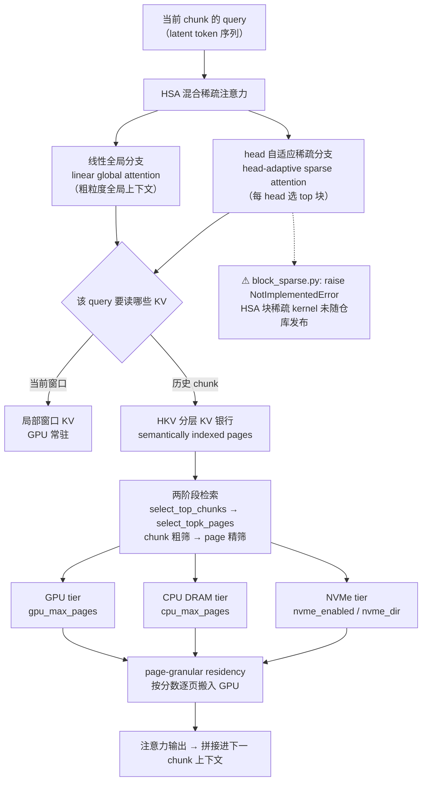

# WorldAttention

> **素材来源性质**：本篇是**仓库/技术报告类笔记**，因此**不套论文 10 节骨架**，改用「能力与边界」骨架（是什么 / 机制与依赖 / 报告口径与证据等级 / 能否落到我们的管线 / 参考与延伸）。主源为官方仓库 **README 与代码**（一手、机器可读），辅助源为**本仓库知识库整理**（`management/docs/knowledge/视频生成训练与推理加速专题.md` §2.1 与 §2.2，下称「我方整理」），后者属**二手性质**，文中逐处标注。截至 2026-09-24，**无同行评议论文、无可核实 arXiv ID**。上游联网调研 brief 见 `.cache/article-note/worldattention/repo-brief.md`。

## 是什么

WorldAttention **不是一个「新模型」，而是一套长上下文视频世界模型的注意力 + 缓存方案**，以**官方开源仓库**的形态发布：它把「算得更省」的注意力内核（**HSA**）与「不重复为历史付费」的缓存系统（**HKV**）绑在一起做协同设计，并明确配套一套**三阶段训练**流程。

| 项 | 值 |
|---|---|
| 形态 | 注意力内核（HSA）+ 分层 KV 缓存（HKV）方案 + 三阶段训练配置；以代码仓库发布，非论文/技术报告 PDF |
| 上游仓库 | <https://github.com/alibaba-damo-academy/WorldAttention> |
| 机构 | 阿里巴巴 **DAMO Academy**（Alibaba Group）主导，合作方 Zhejiang University / HKUST / Hupan Lab / TRE(Alibaba) |
| 许可 | **Apache-2.0** |
| 仓库存续 | 创建 `2026-05-09`，最近推送 `2026-09-07`；stars 3、forks 0、default branch `main`（GitHub API，2026-09-24） |
| 底座 | 仓库内嵌 `wan/`（含 FA 后端与 `xdit_context_parallel.py`）；**未说明基于 Wan2.1 哪个规模 / 是否自训** |
| 论文 | **无同行评议论文、无可核实 arXiv ID**（见下文「报告口径与证据等级」） |
| papers 库 | **未入本地 papers 库**（`data/papers.db` 无该条），故 `papers_id: none` |

署名区作者（README）：Zeyu Zhang¹\*、Jinyuan Mao²\*、Dakai An³\*、Wangbo Zhao³、Hanfeng Lu³、Jiasheng Tang¹,⁴†、Yinghao Yu⁵、Wei Wang³、Bohan Zhuang¹,²†（¹ DAMO Academy, Alibaba；² Zhejiang University；³ HKUST；⁴ Hupan Lab；⁵ TRE, Alibaba；\* 共一，† 通讯）。

一句话：它想解决的是**视频世界模型在长上下文下「注意力是 $\mathcal{O}(N^2)$、历史 KV 反复重算」这两笔重复付费**，做法是把稀疏注意力与多级 KV 驻留合成一个系统。

## 机制与依赖

WorldAttention 由**两个正交部件 + 一条训练流水线**组成。两个部件都必须在线才能得到 README 里那组数字——**这不是一个可以直接 `pip install` 的推理加速器**。其组织关系见 Mermaid 1。

Mermaid 1 读三件事：① **HSA 是双分支**——线性全局分支给粗粒度全局视野、head 自适应稀疏分支按 head 选关键块（对齐 `wan/modules/hsa/` 下的 `attention` / `block_sparse` / `routing` / `coarse_cache` / `pooled_cache` / `distill`）；② **HKV 是两级检索 + 三级驻留**——先在 chunk 级粗筛、再在 page 级精筛，然后按分数把页在 GPU / CPU DRAM / NVMe 之间搬运；③ **虚线是硬边界**——块稀疏 kernel 本体没有发布，方案里的「HSA 稀疏分支」在本地是跑不起来的（见下文「机制边界」）。

### 部件 A：HSA（Hybrid Sparse Attention，混合稀疏注意力）

- **定义**：README 原文为 *integrated linear global attention supplemented with head-adaptive sparse attention*，即**线性全局注意力 + head 自适应稀疏注意力**的组合。
- **代码落点**：`wan/modules/hsa/`（`attention` / `block_sparse` / `routing` / `coarse_cache` / `pooled_cache` / `distill`）。
- **收益定位**：降低**单步注意力成本**，对应《数字人加速》的「内核与稀疏」方向。

### 部件 B：HKV（Hierarchical KV Cache，分层 KV 缓存）

- **定义**：README 原文为 *semantically indexed pages across multi-tier memory* + *fine-grained retrieval and controlled GPU residency*。
- **两级检索**：`pipeline/hkv/retrieval.py` docstring 明确 *Two-stage retrieval over the hierarchical KV bank*，导出 `select_top_chunks`、`select_topk_pages`、`score_pages`、`page_key_index`。
- **三级驻留**：`pipeline/hkv/tiering.py` 第 1 行 docstring 为 *Page-granular residency across GPU, CPU DRAM and NVMe.*；tier 取值含 `"gpu" / "cpu" / "nvme" / "absent"`，`HKVTierManager` 参数含 `gpu_max_pages` / `cpu_max_pages` / `nvme_enabled` / `nvme_dir`。
- **收益定位**：避免长视频对历史 chunk 的重复编码/重复注意力，对应《数字人加速》的「缓存复用」方向。**触发条件有前提**——我方整理 §2.1/§2.2 提示「短上下文中 cache 可能没有收益」。

### 训练前提：三阶段流水线

README 的 `Training` 段给出 8 卡 `torchrun` 流程，按顺序 resume 三个阶段；仓库 `configs/` 下三个配置文件**实际存在**（文件级实证）：

| 阶段 | 配置文件 | 作用（README / 文件名口径） |
|---|---|---|
| Stage 1 | `configs/train_stage1_causal.yaml` | 因果（causal）基座训练 |
| Stage 2 | `configs/train_stage2_hsa_warmup.yaml` | HSA **warmup**（让模型适配稀疏分支） |
| Stage 3 | `configs/train_stage3_hsa_tune.yaml` | HSA **tune**（稀疏分支微调） |

> 结论：这是**需要训练（多阶段）**的路线，不是零训练、也不是单次微调。训练数据、权重与超参**均未随仓库发布**（见「报告口径与证据等级」的未披露表）。

### 机制边界（本节最重要的边界）

**HSA 的块稀疏 kernel 未随仓库发布，因此本方案在当前仓库状态下无法本地复现。**

- 官方代码 `wan/modules/hsa/block_sparse.py` 的 docstring 逐字为 *Block-sparse attention kernel of the HSA sparse branch. Not included in this release.*，函数体直接 **`raise NotImplementedError`**。
- README 的 To-Do 明确列有 `- [ ] Release the HSA kernels` 与 `- [ ] Release the inference pipeline`，且**两项均未勾选**。
- 仓库无 `models/` 目录（README 称权重默认从 `models/` 读取，但未随仓库提供）。

即：能看到的只是**方案骨架与调用接口**，「HSA 到底怎么稀疏、kernel 多快」这一层是**空白**——这正是下文「报告口径」里那组数字不可复现的直接原因。

### 公式

> **来源声明**：README 与仓库代码**没有给出任何编号公式**，也没有注意力掩码/路由的目标函数。以下两个块级公式是**我方形式化**，用于把「稀疏降阶」与「内核倍率 ≠ 端到端倍率」两件事写清楚，**不归到官方名下**。

**式 1：full attention 与 HSA 的复杂度降阶**

$$
\mathcal{C}_{\text{dense}}=\mathcal{O}(N^{2}d),\qquad
\mathcal{C}_{\text{HSA}}=\mathcal{O}\!\left(N d+N\,\bar{s}\,d\right),\qquad \bar{s}\ll N
$$

| 符号 | 含义 |
|---|---|
| $N$ | 序列长度（时空 latent token 数，长视频下很大） |
| $d$ | 每个 token 的 head 维度 |
| $\bar{s}$ | 每个 query 平均被稀疏分支选中的 key 数（$\bar{s}\ll N$） |
| $\mathcal{C}_{\text{dense}}$ | full attention 的计算量，对 $N$ 二次 |
| $\mathcal{C}_{\text{HSA}}$ | HSA 双分支的量级：线性全局项 + 稀疏选中项，对 $N$ 近似线性 |

**中文解释**：full attention 的成本随序列长度**平方增长**，长视频（$N$ 大）时它成为单步成本的主项；HSA 把「每个 query 对全部 key 的稠密打分」换成「线性全局一个粗粒度分量 + 每个 query 只读 $\bar{s}$ 个被选中的 key」，于是主项从 $N^2$ 降到 $N\bar{s}$。**注意**：这个降阶只是「每步更便宜」，它并不减少步数——步数侧要靠 HKV 少重算历史。

**式 2：内核倍率与端到端倍率的差距（Amdahl 视角）**

$$
S_{\text{E2E}}=\frac{1}{(1-p)+\dfrac{p}{S_{\text{kernel}}}}
$$

| 符号 | 含义 |
|---|---|
| $S_{\text{kernel}}$ | 内核级加速比（README 原文：相对 **FlashAttention-3** 的 14.02×） |
| $S_{\text{E2E}}$ | 端到端加速比（README 原文：含 HKV 的 2.21×） |
| $p$ | 基线推理成本中「注意力内核」所占比例 |
| $1-p$ | 未被该内核加速覆盖的部分（VAE、其他模块、未被优化的算子等） |

**中文解释**：只要 $p<1$，端到端倍率就被未被加速的那部分「封顶」——把 README 的 14.02× 与 2.21× 代回，可得 $p\approx 0.59$，即注意力大约只占基线成本六成，其余成本稀释了内核收益。**这是「我方形式化 · 推断」**，两个倍率的分母并不同（14.02× 相对 FA3，2.21× 相对完整推理基线），此式只用于解释量级差，**不能当成官方的实测分解**。

## 报告口径与证据等级

**知识库口径（我方整理 §2.1）**：`单 H100：kernel 14.02×、E2E 2.21×、22fps。**代码/README证据**；论文公开与完整 kernel 状态需谨慎`。

| 指标 | 数值 | 基线 | 原文逐字 | 证据等级 |
|---|---|---|---|---|
| kernel 加速 | **14.02×** | 相对 **FlashAttention-3** | *Our system-oriented kernel design for HSA brings a 14.02× speedup over FlashAttention-3* | 代码 / README 证据 |
| 端到端加速 | **2.21×** | 含 HKV 的整体系统 | *a 2.21× end-to-end speed up together with HKV* | 代码 / README 证据 |
| 推理速度 | **22.0 FPS** | 单张 **NVIDIA H100** | *At inference, WorldAttention sustains 22.0 FPS on a single NVIDIA H100.* | 代码 / README 证据 |

**证据等级 = 代码 / README 证据**（原样带出知识库等级，**不升格**为「论文已验证」，更不与其它论文拼成统一速度排行榜）。三点必须一并记住：

1. **README 是唯一出处**。这组数字在公开网络上**只有该仓库 README 的 Intro 段落**出现过一次——没有技术报告 PDF、没有项目页、没有 HF Paper 页面，也无第三方复现。我方整理 §2.1 记的「kernel 14.02×、E2E 2.21×、22fps」与 README **逐字一致**，无口径冲突。
2. **无同行评议论文**。README 自称论文已上 arXiv（To-Do 里 `- [x] Release the paper on arXiv` 已勾选，该行在 2026-08-11 07:14 的提交中还是 `[ ]`），**但 arXiv ID 仍是占位符**：README 顶部 `Paper` / `Project Page` / `HF Paper` 三个 badge 的 `href` 全部是 `#`，BibTeX 引用块写的是 `journal = {arXiv preprint arXiv:XXXX.XXXXX}`。**arXiv 站内检索、HuggingFace Papers、OpenAlex 三处独立来源均 0 结果**。结论：截至 2026-09-24，**无公开可核实的 arXiv ID，也无同行评议版本**。
3. **不可复现**。由「机制边界」可知，块稀疏 kernel 与推理流水线未发布 → **这组数字在当前仓库状态下无法本地复现**。

**补充数字（README，我方知识库未登记）**：VBench-Long subject consistency **0.9472**、InterVBench **0.9668**。这两项同样只有 README 出处、无第三方交叉验证，**不构成质量结论**。

**未披露项（一律写「未披露」，不猜）**：

| 项 | 状态 |
|---|---|
| 14.02× 的测量设置（序列长度、head dim、dtype、H100 显存型号、稀疏度配置） | **未披露** |
| 22.0 FPS 的生成设置（分辨率、帧数、是否含 VAE decode、是否含 CFG） | **未披露** |
| 训练数据、数据规模、超参、训练成本 | **未披露**（权重亦未发布） |
| 对应的 Wan 底座版本/规模（是否自训） | **未核实** |
| arXiv ID / 正式论文 | **无**（占位 ID；三处检索 0 结果） |
| 项目页 / HF Paper 链接 | **无**（badge `href="#"`） |

**口径差异提示**：我方整理写「kernel 14.02×」时**未带基线名**，README 明确是相对 **FlashAttention-3**；引用时应补上基线名，否则会与「相对完整推理基线」的 E2E 2.21× 混淆。

## 能否落到我们的管线

**结论先行：当前不能作为可直接采用的加速器。** 原因不是效果不确定，而是**可复现性**：HSA 块稀疏 kernel 未开源、推理流水线未发布、权重未提供，方案的三阶段训练还需要一条我们目前没有的基座训练链。

| 前置条件 | 具体内容 | 我方现状 |
|---|---|---|
| 可用的稀疏 kernel | HSA 的 block-sparse kernel 与推理流水线 | **缺失**（`block_sparse.py` 为 `NotImplementedError`，README To-Do 未勾选） |
| 训练链 | 三阶段（causal → HSA warmup → HSA tune）8 卡训练 | **未接入**（本地无对应基座训练链） |
| 权重 | 预训练 / 训练后权重 | **未发布**（无 `models/`） |
| 适用场景 | 长上下文、长视频世界模型 | 我们的 talking-head 片段多为**短上下文**，我方整理提示「短上下文中 cache 可能没有收益」 |

**与《数字人加速》的关系**：该篇「生成侧加速」四方向里点名了 WorldAttention，但**未加链接**（待回补）。WorldAttention 同时命中其中两格——「**内核与稀疏**」（HSA 降单步成本）与「**缓存复用**」（HKV 少重算历史）。它与我方管线的连接点在于**长上下文 KV 与流式缓存**：当生成时长变长、历史 chunk 变多时，「检索 + 分层驻留」这套思路才可能兑现收益。

**可借鉴 vs 不可借用**：

- **可借鉴（思路层）**：① 「两阶段检索」——chunk 级粗筛 → page 级精筛，是可迁移到长时流式缓存的通用做法；② 「分层驻留 + 按分数逐页搬运」——把冷页放到 CPU/NVMe、热页留在 GPU，是长上下文显存治理的通用模式；③ 「稀疏约束放回训练」与本知识库其它工作（FPSAttention 的 QAT、BLADE 的蒸馏）一致：**单独在推理期套稀疏，质量可能反而下降**（我方整理 §2.1 共同点）。
- **不可借用（实现层）**：14.02× / 2.21× / 22 FPS 这组数字、HSA 的 kernel 实现、三阶段训练的配置，**当前都不具备直接采用条件**；也不得把这组「仓库自述、无第三方验证」的数字当作我方性能承诺。

## 参考与延伸

| 类型 | 位置 |
|---|---|
| 上游仓库 | <https://github.com/alibaba-damo-academy/WorldAttention>（Apache-2.0；`README.md`、`wan/modules/hsa/`、`pipeline/hkv/`、`configs/`） |
| 关键代码（一手，可 `grep -n` 复现） | `wan/modules/hsa/block_sparse.py`（`raise NotImplementedError`）；`pipeline/hkv/tiering.py`；`pipeline/hkv/retrieval.py` |
| 联网调研 brief | `.cache/article-note/worldattention/repo-brief.md`（官方仓库、来源清单、与知识库口径核对、未确认项） |
| 配图实况 | `.cache/article-note/worldattention/analysis/image-collection.md`（**无图可发**及理由） |

**相关笔记**：

- [[论文笔记/latent-spatial-memory|Latent Spatial Memory 模型笔记]]——同属「缓存复用」方向，把 3D 记忆存为 diffusion latent；可作为「有论文验证 vs 仅仓库自述」的直接对照。
- [[数字人概述/数字人加速|数字人加速]]——生成侧加速四方向（内核与稀疏 / 步数变少 / 缓存复用 / 并行与推理引擎），本篇命中前两格；链接待回补。
- [[knowledge/视频生成训练与推理加速专题|视频生成训练与推理加速专题]]——§2.1 与 §2.2 登记了 WorldAttention 的口径与证据等级（**我方整理**，本篇证据等级来源）。
- [[论文笔记/README|论文笔记]]——篇目与索引（本篇属「生成侧加速十篇」，papers 库未入库）。
