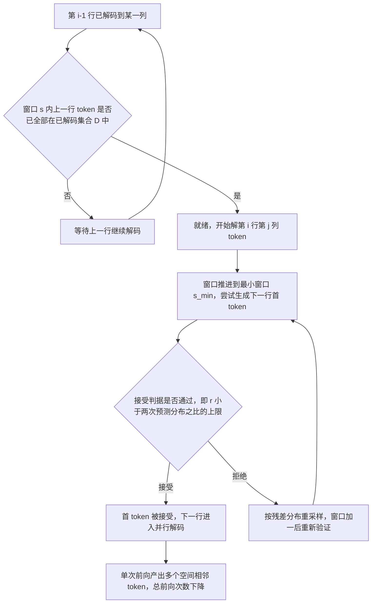

# ZipAR

## 论文信息

| 项 | 值 |
|---|---|
| 标题 | ZipAR: Parallel Autoregressive Image Generation through Spatial Locality |
| 作者 / 单位 | 本次分析产物只登记第一作者 **Yefei He**（脚注 "Work in progress"）；完整作者列表与单位**未登记**，引用时按**未披露**处理 |
| venue / 年份 | arXiv 预印本 `v3`（2025-06-29）；HTML keywords 含 "ICML" 但**正文无收录声明**，会议归属**未披露** |
| arXiv | `2412.04062v3` [cs.CV] |
| 代码仓库 | **全文未见 GitHub / 项目页链接**（对 HTML 全文检索 `github` / `available at` / `will be released` 均无命中）→ **未披露** |
| papers 库 | **未入本地 papers 库**（`data/papers.db` 无 arxiv-2412.04062），按命名规范登记 `papers_id: arxiv-2412.04062` |

> **素材来源性质**：本篇主源为 arXiv LaTeXML 全文 HTML；**无 PDF**（抓取记录 `IncompleteRead`、source tarball HTTP 406），因此全文引用只用**章节号 / 公式号 / 图号 / 表号，不写页码**。训练定位与证据等级引用**本仓库知识库整理**（`management/docs/knowledge/视频生成训练与推理加速专题.md` §2.3，下称「**我方整理**」），属二手性质，已逐处标注。

## 一句话总结

**ZipAR 是「零训练、即插即用」的 AR 视觉生成并行解码调度器**：它利用图像的空间局部性，允许在第 *i*−1 行还没解完时就提前启动第 *i* 行，让**一次前向产出多个空间相邻 token**——只砍**解码步数**，不砍单步成本、不动权重、不加解码头。

- **成本口径唯一**：论文把成本定义为 "Step = 生成一张图所需的模型前向次数"（表 1 / 表 3 表注），收益也只用**步数降幅 + 端到端延迟降幅**度量。
- **零训练**：摘要写 "training-free, plug-and-play parallel decoding framework"，且**不使用 draft 模型、不新增解码头**——并行 token 全部由**原模型 head** 产出（§1、§2.2、§3.2）。
- **经验依据是注意力斜线**：视觉 token 的注意力大量落在「上一行同列」的固定间隔 token 上（图 2 = 论文 Figure 3），这是把「按序列并行」换成「按空间并行」的全部依据。
- **代价是质量在激进配置下会掉**：LlamaGen-XL-512 从 ZipAR-15（1024→562 步，质量持平）压到 ZipAR-3（1024→185 步）时，CLIP 0.287→0.281，且 **Image Reward 从 −0.0818 掉到 −0.3121**（表 2）。
- **只验证图像**：全篇 token 都是 2D 图像特征图（如 24×24），**没有任何视频/时间维实验**；「迁到视频需定义时间维窗口」是**我方整理**的判断，不是论文结论。

### 四问速答

| 问题 | 回答 |
|---|---|
| ① 加速哪一段成本 | **自回归解码步数**：利用空间局部性做**行间并行解码**，把「N 个 token ⇒ N 次前向」压成「一次前向出多个空间相邻 token」。属**推理调度改造**，不涉及注意力内核、KV/记忆压缩、量化、算子融合、多卡或编译（全文均未提出） |
| ② 训练前提 | **零训练**（training-free / plug-and-play）：不动已训练的 NTP 权重、不加参数、不做微调；唯一新增的是推理期超参**最小窗口 $s_{min}$** |
| ③ 证据等级 | **论文已验证（主要是图像 AR；迁到视频需定义时间维窗口）**，来源：**我方整理（知识库 视频生成训练与推理加速专题 §2.3）**。本笔记原样带出，**不升格**（论文未给代码链接，进不了「代码或 README 证据」档；正文表格级数字可核，旗舰数字 91% 无表） |
| ④ 报告口径 | **图像 AR**：LlamaGen-XL-512、MS-COCO、**A100**、batch=1，延迟 **33.17s→5.86s（−82.3%）**、步数 1024→185（−81.9%），**CLIP 略变**（0.287→0.281）。**不可直接外推到视频数字人**（论文无视频实验；收益依赖二维空间局部性） |

## 问题与动机

自回归（AR）视觉生成把图像展平成 raster order（行主序）的一维 token 序列，用 next-token prediction（NTP）逐个生成。成本结构由此变得很硬：**feature map 有 $H\times W$ 个 token，就要 $H\times W$ 次前向**（ImageNet 256×256 实验里是 24×24 ⇒ **576 步**，§4.2.1；LlamaGen-XL-512 是 **1024 步**，Lumina-mGPT-1024 是 **4160 步**）。

论文指出的矛盾是**并行的「方向」选错了**（§1、§2.2）：

- **按序列顺序并行**（Medusa、Jacobi 系）：预测相邻的 *连续* token，但这些 token 在空间上通常落在同一行的远端，语义相关性弱，且 Medusa 需要额外解码头（词表大 ⇒ 头参数大）、投机解码需要额外小模型（显存与工程负担），Jacobi 的收益「in practice … only marginal」。
- **随机顺序并行**（BERT 式掩码生成，如 MAR）与 **next-scale 预测**（VAR）：属**不同训练范式**，不是即插即用。
- **AR 视觉生成的实际依赖结构**：论文观察注意力分数后指出，显著注意力被分配给「**上一行同列的 token**」（Figure 3 的斜线），即**空间局部性**——图像相邻区域强相关、远距区域依赖极弱。

由此得到的 insight 是：既然依赖主要是「上一行同列」，那么**第 $i$ 行的 $x_{i,j}$ 不必等第 $i$−1 行整行解完**，只要它依赖的**窗口内**那些上一行 token 已经解码，就可以开工。这一步把「逐行串行的棋盘」改成「**沿对角推进的并行波前**」。

图 1 是全文的定位图：四个子图给出同一张 image token 网格上**四种并行方向**的对照。(a) 是基线（一次前向一个 token，串行）；(b)(c) 是已有的 LLM 式并行解码谱系——沿**序列**方向或**随机**方向铺开；(d) 才是本文主张的**沿空间邻域**铺开，且**不新增任何解码头**。读这张图时要注意 (d) 的并行单位是「空间上相邻的行间 token」，因此它天然依赖「图像有 2D 结构」这个前提——这也正是它无法直接照搬到视频时间维的原因。

## 方法精析

ZipAR 由三个可独立读的部分组成：**(A) 固定窗口的准入判据**（谁可以开始生成）→ **(B) 行首 token 的输入缺口修补**（工程落地的关键）→ **(C) 自适应窗口 + 拒绝采样**（用两次预测的一致性决定是否接受并行 token）。

### A. 固定窗口的准入判据

论文定义**局部窗口 $s$**：若上一行中位于 $x_{i-1,j+s}$ **之后**的 token 对 $x_{i,j}$ 影响可忽略，则 $x_{i,j}$ 可以开始生成。准入条件写成式 (1)（§3.2）：

$$
C(i,j)=\begin{cases}1,&\text{if }\{x_{i-1,k}\mid j\leq k<j+s\}\subseteq\mathbb{D}\\0,&\text{otherwise}\end{cases}
$$

| 符号 | 含义 |
|---|---|
| $x_{i,j}$ | 第 $i$ 行第 $j$ 列的视觉 token（把一维 raster order 序列按行宽重排成二维） |
| $i$ / $j$ | 行索引 / 列索引 |
| $s$ | **局部窗口大小**（predefined local window size），定义两行 token 是否「空间相邻」 |
| $\mathbb{D}$ | **已解码 token 集合**（set of decoded tokens） |
| $C(i,j)$ | 二值准入指示；$C(i,j)=1$ 表示 $x_{i,j}$ 已可生成 |

**读法**：只要上一行**同列起、宽度 $s$ 的窗口**全部已在 $\mathbb{D}$ 里，当前行对应 token 就绪。注意条件方向——要求的是上一行窗口内 token **已解码**，而不是「用到 $x_{i-1,j+s}$ 本身」。一旦某行首 token 生成，该行后续 token 就按 NTP 逐个生成，**与上一行未完成的部分同时推进**。消融显示自适应窗口一致优于固定窗口（图 6 = 论文 Figure 6，正文只给曲线、**未给数值**）。

### B. 行首 token 的「输入缺口」修补（复现第一难点）

生成第 $i$ 行首 token $x_{i,0}$ 需要上一行最后一个 token 作为 AR 输入，但在 ZipAR 下**它还没生成**。论文按模型类型给两种解法（§3.2）：

| 模型类型 | 修补方式 | 代表模型 |
|---|---|---|
| **带 end-of-row（EOR）特殊 token** 的动态分辨率模型 | 提前插入 EOR token，其值**预定、后续无需更新** | Lumina-mGPT、Emu3 一类 |
| **无 EOR token** 的模型 | 给上一行最后一个 token **临时赋值**，取值来自「**已解码的、空间上最近邻的 token**」 | LlamaGen 一类 |

> **披露最薄的一环**：临时赋值具体取哪个 token、误差如何随窗口传播，正文只有一句定性描述，**无公式、无伪代码、无消融**。若要做二次实现，这是风险最高点。

### C. 自适应窗口 + 拒绝采样

固定窗口在「容易的行」上浪费、在「难的行」上不够，于是论文引入自适应分配（§3.3），机制与 **speculative decoding 同构**（论文原话 "analogous to speculative decoding"，**但不使用 draft 模型**）：

1. 给定最小窗口 $s_{min}$，生成 $x_{i,s_{min}-1}$ 后**尝试**生成下一行首 token $x_{i+1,0}$；
2. 下一步「上一行多出一个 token」后，用**略大的窗口** $s_{min}+1$ **重新生成**同一个 token；
3. 用**两次预测的一致性**做接受判据，即式 (2)；

$$
\tilde{C}(i+1,0)=\begin{cases}1,&\text{if }r<\min\left(1,\dfrac{p(x\mid x_{0,0},...,x_{i,k})}{p(x\mid x_{0,0},...,x_{i,k-1})}\right)\\0,&\text{otherwise}\end{cases}
$$

| 符号 | 含义 |
|---|---|
| $\tilde{C}(i+1,0)$ | 行首 token $x_{i+1,0}$ 在窗口 $k$ 下生成的**自适应准入指示**；$=1$ 表示 ready to be generated |
| $k$ / $k-1$ | 相邻的两个窗口大小（论文原句 "For consecutive window sizes $k+1$ and $k$ in row $i$"） |
| $r\sim U[0,1]$ | 从均匀分布采样的接受阈值 |
| $p(x\mid x_{0,0},...,x_{i,k})$ | **大窗口**下下一 token 的条件分布 |
| $p(x\mid x_{0,0},...,x_{i,k-1})$ | **小窗口**下的条件分布；两者之比刻画「小窗口采出的 token 有多可信」 |

4. 被拒绝时按式 (3) 从**残差分布**重采样，重采样结果在下一步被验证；若仍不满足就继续扩大窗口，直到通过或上一行已完全生成。

$$
x_{i+1,0}\sim\frac{\max(0,p(x\mid x_{0,0},...,x_{i,k})-p(x\mid x_{0,0},...,x_{i,k-1}))}{\sum_{x}\max(0,p(x\mid x_{0,0},...,x_{i,k})-p(x\mid x_{0,0},...,x_{i,k-1}))}
$$

| 符号 | 含义 |
|---|---|
| $x_{i+1,0}$ | 被拒绝后重新采样的行首 token |
| $\max(0,\cdot)$ | 逐类截断到非负（大窗口分布 − 小窗口分布） |
| $\sum_{x}$ | 对**整个词表**求和，做归一化；论文**未给数值稳定处理** |
| $s_{min}$ | 最小窗口大小，唯一新增的推理超参（配置名 `ZipAR-n` 中的 $n$） |

**两个必须如实说的边界**：① 论文**未证明** ZipAR 的输出分布与 NTP 等价，只说重采样结果「下一步被验证」；② §1 的 "without introducing additional overhead" 指的是**不增参数/头/额外模型**，**不是零额外前向**——拒绝采样本身会触发重生成（论文未报告接受率或平均重采样次数，属**未披露**）。

图 2 是 ZipAR 唯一支撑「空间局部性」的**经验证据**（§1 与 §3.2 都复述它）。两条模型（Lumina-mGPT-7B 与 LlamaGen-XL）都出现清晰的**斜向条纹**：关注强度在「同一列、上一行」的方向上周期性抬升，说明 AR 视觉模型的 token 依赖**不是均匀铺在整段前缀上**，而是集中在同列的历史 token 上。这直接解释了为什么窗口可以做得远小于「整个前缀」：斜线之外的位置本来就没有多少注意力质量。反过来也说明这套方法**强依赖这个斜线结构**——如果换成依赖结构更均匀的模态（例如时间维跨度很大的视频 token），窗口准入的假设就不自动成立。

图 3 把式 (1) 翻译成一张可数的网格图（本图 $s=2$）：上一行**同列起两格**已解码，则下一行对应格就绪——可以观察到「就绪区域」在网格上是**一块斜向推进的波前**，而不是整行整行地推进。读图时注意它与图 1(d) 的分工：图 1(d) 讲**为什么按空间并行**，图 3 讲**按什么规则并行**（具体到哪个格可以开工）。也正因为它把并行规则画成了二维网格上的一次性快照，图里**看不到**自适应窗口与拒绝采样这两层动态逻辑——那部分只能靠式 (2)/(3) 与 §3.3 的文字理解。

## 训练与实现细节

| 项 | 值 | 披露状态 |
|---|---|---|
| 训练前提 | **零训练**（training-free / plug-and-play）；不改权重、不加解码头、不微调、不用 draft 模型 | 已披露（摘要、§1、§2.2、§3.2） |
| 基座模型 | LlamaGen-L / LlamaGen-XL / LlamaGen-XL-512、Lumina-mGPT-7B-768/1024、Emu3-Gen（Emu3 仅出现在定性图） | 已披露（§4.1、表 1–3、§4.4） |
| 适用范式 | 仅**raster order + NTP 目标**训练出来的 AR 视觉模型（§2.1 显式限定）；BERT 式掩码生成、next-scale、扩散模型**不在范围内** | 已披露 |
| 新增超参 | 最小窗口 $s_{min}$（文中以 `ZipAR-n` 扫描，$n$ = 3, 7, 11, 12, 14, 15, 16, 17, 20） | 已披露 |
| 硬件 / 框架 | "Nvidia **A100** GPUs" + PyTorch | **卡数、型号、显存未披露** |
| 延迟口径 | **batch size = 1**（表 1 / 表 3 表注） | 已披露 |
| 采样超参 | ZipAR **不改变**最优采样温度与 CFG（表 4：ZipAR-16 最优 CFG = 2.0；表 5：最优温度 = 1.0） | 已披露（§4.3.2） |
| 拒绝采样开销 | 重生成/扩窗迭代的额外前向**未单独披露**；平均重采样次数、接受率、扩窗迭代上限均**未披露** | **未披露** |
| 95% 注意力保留窗口 | 论文自选 95% 阈值用于分析（图 5），窗口下界与质量拐点之间**无判定准则** | 部分披露 |
| 代码 / 权重 / 复现脚本 | HTML 全文无仓库链接 | **未披露** |

**一句话**：这是纯**推理期调度**方法——它的能力上限完全由基座 NTP 权重决定，所以「零训练」不等于「不需要训练过的基座」，而是「不额外训练」。

## 推理与系统链路

| 阶段 | 处理 | 是否被 ZipAR 改变 |
|---|---|---|
| 文本 / 类别条件输入 | prompt 编码（或类条件 embedding） | 否 |
| 视觉 token 生成（AR 主体） | **跨行并行解码**：在线判定准入（式 1）→ 行首 token 缺口修补（EOR / 临时赋值）→ 自适应窗口 + 拒绝采样（式 2/3） | **是**（唯一改动点） |
| 单步前向 | 一次前向处理「当前推进中的多行」所需 token 窗口 | 否（仍是原模型前向，只是**内容与窗口更大**） |
| VQ-VAE 视觉解码 | token → 像素 | 否（论文未说明 VQ 解码是否计入延迟） |
| 输出 | 图像 token 序列 → 图像（ImageNet 生成 384×384 后 resize 到 256×256 评测） | 否 |

系统层**没有**任何 kernel、量化、序列并行或编译改造；「多卡」也未涉及。因此 ZipAR 与注意力内核类工作（如 FPSAttention 的 FP8 × 稀疏）、系统类工作（DAX 的序列并行 / compile / INT8）**可以叠加但不同层**——论文自己也声明它与 Medusa / Jacobi 一类方法正交、可叠加（§2.2 末、§5，属**未来工作、未验证**）。

## 实验与结果

### 主结果一：ImageNet 256×256 类条件（表 1，LlamaGen-L / LlamaGen-XL，CFG = 2.0，FID↓）

| 模型 | 方法 | Step（降幅） | Latency s（降幅） | FID ↓ |
|---|---|---|---|---|
| LlamaGen-L | NTP | 576 | 15.20 | 3.16 |
| LlamaGen-L | SJD（Teng et al., 2024） | 367（−36.3%） | 10.83（−28.8%） | 3.85 |
| LlamaGen-L | ZipAR-16 | 422（−26.7%） | 11.31（−25.6%） | **3.14** |
| LlamaGen-L | ZipAR-14 | 378（−34.4%） | 10.16（−33.2%） | 3.44 |
| LlamaGen-L | ZipAR-12 | 338（−41.3%） | 9.31（−38.8%） | 3.96 |
| LlamaGen-XL | NTP | 576 | 22.65 | 2.83 |
| LlamaGen-XL | SJD | 335（−41.8%） | 13.17（−41.8%） | 3.87 |
| LlamaGen-XL | ZipAR-12 | 331（−41.8%） | 13.17（−41.8%） | **3.67** |

**读法**：保守配置（ZipAR-16）几乎无损甚至略优（FID 3.14 vs 3.16）；激进配置质量掉得比 SJD 慢（ZipAR-12 的 3.67 vs SJD 的 3.87，且步数更少）。**注意 422/576 与 11.31/15.20 的降幅基本同阶**（−26.7% vs −25.6%），说明延迟大体随步数线性下降，**没有额外的每步开销放大**——但这只是表内数值对照，论文未做 kernel 级拆分。

### 主结果二：MS-COCO 文生图（表 3，含延迟；CLIP↑）

| 模型 | 方法 | Step（降幅） | Latency s（降幅） | CLIP ↑ |
|---|---|---|---|---|
| LlamaGen-XL-512 | NTP | 1024 | **33.17** | 0.287 |
| LlamaGen-XL-512 | SJD | 635（−38.0%） | 24.80（−25.2%） | 0.283 |
| LlamaGen-XL-512 | ZipAR-15 | 562（−45.1%） | 18.98（−42.7%） | 0.287 |
| LlamaGen-XL-512 | ZipAR-11 | 451（−55.9%） | 14.65（−55.8%） | 0.286 |
| LlamaGen-XL-512 | ZipAR-7 | 324（−68.4%） | 10.24（−69.1%） | 0.285 |
| LlamaGen-XL-512 | ZipAR-3 | **185（−81.9%）** | **5.86（−82.3%）** | **0.281** |
| Lumina-mGPT-7B-768 | NTP | 2352 | 91.70 | 0.313 |
| Lumina-mGPT-7B-768 | ZipAR-11 | 588（−75.0%） | 50.32（−45.1%） | 0.312 |

**这就是知识库「我方整理」行里那组数字的出处**：LlamaGen-XL-512、A100：**33.17s→5.86s，延迟 −82.3%；CLIP 略变**（0.287→0.281）。

> **表 3 里有一个必须点出的异常**：Lumina-mGPT-7B-768 上 ZipAR-20（1063 步、63.28s）反而**比 SJD（1054 步、60.27s）更慢**——步数多 0.85%，延迟多 5.0%。即**步数 ≠ 延迟的严格线性**，存在未披露的实现级差异（论文未解释）。另外论文表中把该模型写成 "Luming-mGPT-7B-768"（笔误），引用时用 Lumina 拼写并加注。

### 主结果三：多自动指标（表 2）与两条消融

- **质量随窗口压缩的退化不是均匀的**：LlamaGen-XL-512 从 ZipAR-15（562 步）到 ZipAR-3（185 步）时，VQAScore 0.6534→0.6343、HPSv2 0.2637→0.2599、Aesthetic 5.39→5.32 都只是小降，但 **Image Reward 从 −0.0690 掉到 −0.3121**。即**「人类偏好类」指标先崩，聚合型指标掉得慢**——这是读表 2 的关键陷阱（论文未单独评论）。
- **分辨率越高收益越大**：论文自述文生图模型的加速比高于类条件 LlamaGen-L，"primarily attributed to the larger spatial resolution"（§4.2.2）。
- **自适应 vs 固定窗口**（图 6 / §4.3.1）：相近步数预算下自适应窗口 FID 始终更低，但**只给曲线、无具体数值**。
- **采样超参不冲突**（表 4/5）：ZipAR 不改变最优 CFG 与采样温度。

### 报告口径与边界（不可与其它论文直接横比）

| 维度 | 论文口径 | 边界 |
|---|---|---|
| 硬件 | "All experiments are conducted with Nvidia A100 GPUs and Pytorch framework."（§4.1） | **卡数与型号未披露**；延迟为 batch=1 |
| 模型 | LlamaGen-L / XL / XL-512、Lumina-mGPT-7B-768/1024、Emu3-Gen | 全部是**图像** AR 模型，**无视频** |
| 分辨率 | ImageNet 256×256（生成 384 再 resize 评测）；512；768；1024 | 窗口大小以「token 数」计，**跨分辨率不可直接沿用同一数值** |
| 质量口径 | FID↓（50000 张、ADM TF suite）、VQAScore / HPSv2 / ImageReward / Aesthetic、CLIP | **多口径混用，FID 与 CLIP/VQAScore 不可互换** |
| 加速定义 | **只报 Step 降幅 + 端到端 Latency 降幅** | 不含 kernel 倍数；**不可与 FPSAttention（kernel×）、DAX（8 卡×）混排** |
| 旗舰数字 | "up to **91%** forward step reduction"（Emu3-Gen，摘要 / 图 1 / §4.4） | **无对应量化表**（表 1–3 均无 Emu3-Gen 行），无 Emu3 的延迟 / 分辨率；**证据强度低于表格级**，须单独陈述 |

## 相关工作与定位

| 类别 | 代表工作 | 与 ZipAR 的差异 |
|---|---|---|
| 投机解码 | Chen et al., 2023 | 需要额外小 draft 模型 → 显存与工程负担；ZipAR **不用 draft** |
| 多解码头自投机 | Medusa | 需要额外解码头，词表大 ⇒ 头参数大；ZipAR 的并行 token **全部走原模型 head** |
| Jacobi / 推测 Jacobi（**SJD**） | Santilli et al., 2023；Teng et al., 2024 | 随机猜 token 后迭代收敛，视觉收益边际；SJD 是表 1 / 表 3 的**直接对标基线**，ZipAR 在步数与质量上同时占优 |
| 前瞻解码 / 一致性 LLM | Lookahead；CLLMs | CLLMs 需一致性损失微调；ZipAR **零训练** |
| 图像 AR 的其它并行范式 | MAR（随机顺序）、VAR（next-scale） | 属**不同训练范式**，非即插即用 |
| 正交可叠加 | 投机解码 / Jacobi 系 | 论文声称正交（§2.2 末、§5）——**属未来工作，未验证** |
| 定位（**我方整理**） | `knowledge/视频生成训练与推理加速专题.md` §2.3 | ZipAR 被归入「**自回归并行：减少串行生成步数**」，训练要求「零训练」，与 NAR（从头训练）、FlashAR（后训练）同组；在「训练费光谱」上位于**零训练**一端 |

## 局限与启发

### 论文自陈与素材层面的局限

1. **只有图像**：全篇 token 均为 2D 图像特征图，**无任何视频、时间维或音频实验**（论文明确；视频适配为**未披露**）。
2. **正确性无形式化证明**：式 (2)/(3) 是投机解码的类比，论文未证明输出分布与 NTP 等价。
3. **91%（Emu3-Gen）无量化表**：只有摘要 / 图 1 / §4.4 的文字与定性图，无 step 基线、无延迟、无分辨率、无质量指标。
4. **无代码仓库**：全文未给 GitHub 或项目页链接，**不能**升格为「代码或 README 证据」或「仓库 benchmark」。
5. **实现开销不透明**：拒绝采样带来的重生成次数、扩窗迭代上限、EOR / 临时赋值分支的实现细节均**未披露**；VQ 解码是否计入延迟**未披露**。
6. **窗口下界无判定准则**：95% 注意力保留阈值（图 5）是论文自选，与质量拐点（Image Reward 快速退化）之间没有可用窗口的判据。
7. **泛化面窄**：只在 3 个模型族（LlamaGen / Lumina-mGPT / Emu3）上验证，tokenizer 分辨率与 codebook 差异对最优窗口的影响**未讨论**。

### 论文局限 vs 我们结论

**我方未接入 ZipAR**（本地训练源码矩阵无 LlamaGen / Lumina-mGPT 等 NTP 视觉 AR 条目），故本表只记**定位与可复用点**，不给任何「本地可用」承诺：

| 维度 | 论文口径 | 我们的结论 |
|---|---|---|
| 本地是否接入 | — | **未接入**；本地无对应 NTP 图像 AR 训练链与权重，只作方法参考 |
| 加速的是哪一段 | 解码步数（前向次数） | **自回归解码步数**（推理调度改造）；不涉及注意力内核、缓存、量化、系统层 |
| 训练前提 | 零训练 / 即插即用 | **零训练**；边界是「不额外训练」，能力上限仍由基座 NTP 权重决定 |
| 证据等级 | 表 1–5 + 图 1/6/7（91% 仅定性图） | **论文已验证（主要是图像 AR；迁到视频需定义时间维窗口）**，来源：**我方整理（知识库 视频生成训练与推理加速专题 §2.3）**；**不升格** |
| 报告口径 | LlamaGen-XL-512、MS-COCO、A100、batch=1 | 33.17s→5.86s（−82.3%）、步数 1024→185（−81.9%）、CLIP 0.287→0.281。**图像 AR 结果，不可直接外推到视频数字人** |
| 视频 / 数字人可用性 | 论文**未验证** | **待自测**：时间维窗口需自行定义；帧间是否仍串行、talking-head 短片段是否有收益**未知** |
| 本地复现成本 | 100 步以内的推理改动，无训练 | **低**（理论门槛最低的一个），但**复现第一难点**是行首 token 缺口修补（§3.2 披露过薄）；本机 GPU 口径与论文 A100 不同，数值不可对齐 |
| 可复用点 1 | 式 (1) 的窗口准入判据 | **机制可搬**：只要自训了 raster-order NTP 视觉 AR 模型，就能按「上一行同列窗口已解码 ⇒ 当前 token 就绪」写调度器，不需要改权重 |
| 可复用点 2 | 式 (2)/(3) 的接受-残差重采样 | **范式可搬**：把「两次不同窗口预测的一致性」当接受判据，是免训练并行解码的通用写法，可用于其它模态的调度器设计 |
| 可复用点 3 | 「收益随空间分辨率上升」（§4.2.2） | **选型判断**：低分辨率小模型上收益会明显缩水；反过来说，高分辨率长序列才值得引入这套调度 |
| 与本地其它路线的关系 | 与 NAR / FlashAR 并列 | ZipAR 是三者中**训练门槛最低**（零训练）但**收益最依赖「图像空间局部性」前提**的一条；它**不能**加速现有的扩散式数字人管线（论文只对 NTP 目标训练出的 AR 视觉模型有效，§2.1） |

### 可操作启发

1. **归类到「减少串行解码步数」而不是「注意力加速」**：引用时写「推理调度改造（零训练）」，与 kernel/量化/训练改造路线分层。
2. **引用数字必带四件套**：模型 + 分辨率 + 硬件（A100）+ batch(=1)，并显式声明**不可跨论文横比**。
3. **91% 单独成句并标注**「论文自述、仅定性图、无量化表」，不要与表 1/表 3 的数值并列成同一证据强度。
4. **「零训练」要写全**：零训练 = 不训练、不改权重、不加解码头；**不减少单步成本**，只减少步数。
5. **迁移措辞**：写「ZipAR **未验证视频**；把空间局部性扩展到时间维窗口属**待自测**」，并注明这是**我方推断 / 我方整理**，不是论文结论。

## 术语与符号表

| 术语 | 英文 | 含义 |
|---|---|---|
| 自回归视觉生成 | autoregressive (AR) visual generation | 以 NTP 目标训练的视觉生成模型；本文只针对这一类 |
| 下一 token 预测 | next-token prediction (NTP) | 每次前向只出一个 token 的经典范式，即本文的加速基准 |
| 并行解码 | parallel decoding | 一次前向产出多个 token；本文特指**跨行**并行 |
| 光栅序 | raster order | 视觉 token 从左到右逐行展平成一维序列 |
| 空间局部性 | spatial locality | 图像相邻区域强相关、远距区域依赖极弱；本方法的全部动机 |
| 局部窗口 | local window size（$s$） | 判定跨行 token 是否「空间相邻」的阈值 |
| 自适应窗口分配 | adaptive window size assignment | 不固定 $s$，按上下文动态扩窗并配拒绝采样 |
| 拒绝采样 | rejection sampling | 类比投机解码的接受/拒绝判据与残差重采样 |
| 推测解码 | speculative decoding | 本文的类比对象（**不实际使用 draft 模型**） |
| 推测 Jacobi 解码 | SJD | 免训练 AR 文生图并行解码基线，本文表格中的直接竞争对手 |
| 行结束 token | end-of-row token | 动态分辨率模型行末的特殊 token，可**提前插入**以启动下一行 |
| 零训练 / 即插即用 | training-free / plug-and-play | 不动权重、不加参数、不微调 |
| 步数 | Step / forward pass | 生成一张图所需的模型前向次数，本文唯一成本指标 |
| 延迟 | latency | 端到端生成耗时（秒），**batch size = 1** 下测量 |
| 类条件生成 | class-conditional | ImageNet 上的类别标签条件生成（本文的主基准之一） |
| 无分类器引导 / 采样温度 | CFG / temperature | 采样超参；论文结论是 ZipAR **不改变**其最优值 |
| ZipAR-*n* | — | 最小窗口大小为 *n* 的 ZipAR 配置（*n* **不是**加速倍数） |

| 符号 | 含义 |
|---|---|
| $x_{i,j}$ | 第 $i$ 行第 $j$ 列的视觉 token |
| $s$ / $s_{min}$ / $k$ | 局部窗口大小 / 自适应方案的最小窗口 / 自适应过程中的候选窗口 |
| $\mathbb{D}$ | 已解码 token 的集合 |
| $C(i,j)$ | 式 (1) 的固定窗口准入指示（1 = ready） |
| $\tilde{C}(i+1,0)$ | 式 (2) 的自适应准入指示（1 = ready） |
| $p(x\mid x_{0,0},...,x_{i,k})$ | 大窗口下的下一 token 条件分布 |
| $p(x\mid x_{0,0},...,x_{i,k-1})$ | 小窗口下的同一条件分布 |
| $r\sim U[0,1]$ | 均匀分布采样的接受阈值 |
| $H\times W$ | 特征图尺寸（ImageNet 实验为 24×24 ⇒ 576 步） |
| $n$ | `ZipAR-n` 中的最小窗口大小 |

## 相关文档

- 加速专题与定位：[[knowledge/视频生成训练与推理加速专题|视频生成训练与推理加速专题]] §2.3（本笔记的证据等级与训练要求来源）、[[数字人概述/数字人加速|数字人加速]]（已点名本工作，链接待补）
- 同组对照（自回归并行三路线）：邻域自回归 NAR（`nar.md`）与后训练加速 FlashAR（`flashar.md`）——两篇仍为「待写」，建成后回补链接
- 相邻方向对照：[[论文笔记/fpsattention|FPSAttention 模型笔记]]（把加速约束放回训练阶段的注意力侧）、[[论文笔记/blade|BLADE 模型笔记]]（块稀疏 + 步数蒸馏联合训练）、[[论文笔记/latent-spatial-memory|Latent Spatial Memory 模型笔记]]（长视频缓存侧）
- 篇目与索引：[[论文笔记/README|论文笔记]]（本篇属「生成侧加速十篇」，papers 库未入库，仅登记 arXiv）
